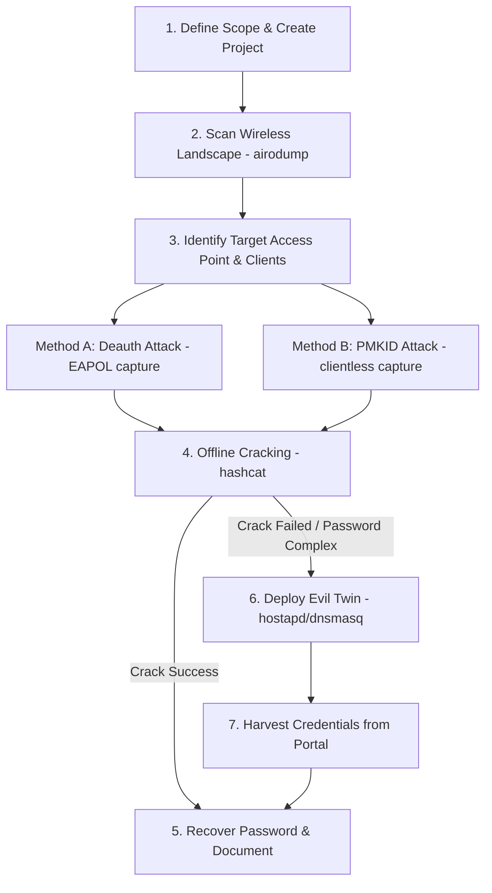

# Wcrack Startup & Development Guide

Wcrack is a portable wireless security auditing control panel and orchestrator. It supports real-time network scanning, deauthentication attacks, PMKID credential captures, Evil Twin captive portals, and Hashcat-backed offline handshakes cracking.

---

## 🚀 Quick Start (Development Mode with Simulator)

You can run the entire application on **Windows** or other development environments without needing physical WiFi adapters or root privileges. A decoupled **simulation daemon** (`WcarckSimulator`) automatically starts on Windows (or when `WCARCK_SIMULATE=1` is set), generating realistic mock data (discovered APs, clients, handshakes, portal metrics, and passwords) while running through the same asynchronous pipelines and DB layers.

### Step 1: Pre-requisites
- **Python 3.11+** (virtual env recommended)
- **Node.js 18+** (with npm)
- **uv** (optional, for ultra-fast python packaging)

### Step 2: Set Up & Launch Backend
1. Open a terminal in the `/backend` directory.
2. Initialize virtual environment and install dependencies:
   ```bash
   python -m venv .venv
   .venv\Scripts\activate
   pip install -r pyproject.toml
   # Or using uv:
   uv pip install -e .
   ```
3. Start the FastAPI backend server:
   ```bash
   .venv\Scripts\python -m uvicorn wcarck.main:app --host 127.0.0.1 --port 8080 --reload
   ```
   *Note: On Windows, the mock simulator will automatically print `Dev simulator daemon started successfully` on startup.*

### Step 3: Set Up & Launch Frontend
1. Open another terminal in the `/frontend` directory.
2. Install Node modules:
   ```bash
   npm install
   ```
3. Run the Vite development server:
   ```bash
   npm run dev
   ```
4. Open your browser and navigate to `http://localhost:5173`.

---

## 🎮 Step-by-Step Guide to Using Simulator Mode

To test Wcrack's audit tools end-to-end without physical hardware or root access, follow these steps:

### 1. Toggle Simulator Mode
- In the top-right corner of the top navigation bar, locate the **CPU Icon** (`Simulation Mode`).
- **Click the CPU icon** to activate/deactivate simulation mode. When active, the icon pulses green and a notification confirms `Simulation mode activated`.
- When active, the simulator instantly injects virtual mock adapters (`wlan_mon` for scanning, and `wlan_ap` for Evil Twin) into your hardware list. These mock adapters will immediately appear on your Dashboard and Adapters page, making them selectable for simulated attacks.

### 2. Create and Scope a Project
- Navigate to the **Projects** page (from the left sidebar).
- Click **Create Project**, enter a name (e.g., `Simulated Audit`), and client information.
- Click **Activate** on the newly created project. An active project establishes the scoping rules.

### 3. Run a Simulated Recon Scan
- Navigate to the **Reconnaissance** page.
- Select the simulated adapter (`wlan_mon`) from the interface dropdown.
- Click **Start Scanner**.
- You will see the **Access Points** list populate with mock WiFi networks (e.g., `Acme_Corporate`, `Netgear_Home`) and their connected client stations in real-time.
- Click on any network to inspect its connected clients.

### 4. Capture a Simulated Handshake
- Click **Start Attack** on a network or head to the **Attacks** page.
- Choose your attack vector:
  - **Deauthentication Attack**: Select a target AP and client station, then click **Start Deauth**. The simulator mimics raw frame injection bursts and captures a WPA EAPOL handshake.
  - **PMKID Attack**: Select an AP and click **Start PMKID** to capture a clientless RSN IE PMKID hash.
- Navigate to the **Captures** page. You will see your newly captured handshakes listed with a `Valid` status.

### 5. Run Offline Cracking
- Go to the **Crack** page.
- Select your captured EAPOL handshake or PMKID hash from the dropdown.
- Choose a wordlist (e.g., `rockyou.txt`) and click **Start Cracking**.
- The Hashcat simulation will begin. The progress bar will increment up to 100%, and once completed, it will recover the plain text password (e.g., `password123`) and log it in the **Credentials** database.

### 6. Test Evil Twin & Captive Portal
- Navigate to the **Evil Twin** page.
- Choose a portal template (e.g., "Router Firmware Update" or "Public WiFi Login") and enter the SSID to clone.
- Click **Deploy Evil Twin**.
- The simulator will generate mock DNS requests, log client associations, redirect traffic, and capture user credentials submitted through the portal.
- Go to the **Credentials** page to inspect the captured credentials and export auditing reports.

---

## 📡 Production Deployment (Linux Boot with Physical Hardware)

In production, Wcrack runs on Linux (e.g., Ubuntu, Kali) with root access and physical USB wireless adapters supporting monitor mode and packet injection (e.g., Atheros AR9271, RT3070).

### Step 1: System Pre-requisites
Make sure the required suite tools are installed:
```bash
sudo apt update
sudo apt install -y airodump-ng aireplay-ng hcxdumptool hashcat hostapd dnsmasq nftables sqlite3
```

### Step 2: Running Backend as Root
Since accessing physical interfaces and driving raw sockets requires root privileges:
```bash
cd backend
sudo .venv/bin/uvicorn wcarck.main:app --host 0.0.0.0 --port 8080
```

---

## 🛠️ The Wcrack Toolset Explained

Wcrack unifies several industry-standard tools under its visual control panel. Below is an explanation of what each tool does and why it is used:

### 1. **airodump-ng** (Reconnaissance)
* **What it does**: Switches the wireless interface into Monitor Mode (listening to raw radio packets) and hops across channels to capture all 802.11 beacon, probe response, and data frames.
* **Why we use it**: It lists all nearby Access Points (BSSIDs), client stations, signal strengths (RSSI), channels, and encryption modes. It acts as our "eyes" to map the target environment.

### 2. **aireplay-ng** (Deauthentication)
* **What it does**: Injects raw 802.11 management frames (specifically Deauthentication packets) into the air. These packets masquerade as the target router, telling the client to disconnect immediately.
* **Why we use it**: When the disconnected client automatically reconnects to the legitimate router, they exchange a 4-way cryptographic handshake (EAPOL). We capture this handshake to crack the password offline.

### 3. **hcxdumptool** (PMKID Capture)
* **What it does**: Sends association request packets to routers and captures the RSN IE (Robust Security Network Information Element) containing the PMKID hash.
* **Why we use it**: Unlike standard handshakes which require an active client device to be connected to the router, PMKID capture can be run against a router with *zero active clients*. This makes it silent and highly efficient.

### 4. **hostapd** (Evil Twin Rogue AP)
* **What it does**: Spawns a software-defined wireless access point (AP).
* **Why we use it**: It lets us broadcast a fake clone of the target network (same SSID) on a different channel to trick victim devices into connecting to us instead of the real router.

### 5. **dnsmasq** (IP & DNS Interception)
* **What it does**: Provides DHCP leases (assigning IP addresses like `10.0.0.x` to connected clients) and runs a DNS server.
* **Why we use it**: It acts as a DNS proxy that intercepts all lookup requests. No matter what URL the victim types (e.g. `google.com`), dnsmasq resolves it to our own local IP, forcing them to see our Captive Portal page.

### 6. **FastAPI Captive Portal** (Credential Harvesting)
* **What it does**: Hosts responsive web pages mimicking router login portals, ISP upgrades, or public WiFi terms of service.
* **Why we use it**: When clients connect to our Evil Twin, the OS triggers a "Captive Portal" prompt. The user is asked to submit their WPA2 passphrase to access the internet, which is captured and logged.

### 7. **hashcat** (Offline Crack Engine)
* **What it does**: Takes captured EAPOL handshakes or PMKID hashes and performs dictionary attacks using pre-compiled lists of millions of candidate passwords.
* **Why we use it**: Because it runs entirely offline on our local CPU/GPU, we can test millions of passwords per second without sending a single packet over the air, leaving no footprint on the target network.

---

## ⏱️ Chronology of a Wireless Penetration Audit

A typical wireless audit follows a strict, step-by-step chronology to move from zero access to credential recovery:



### Phase 1: Scoping and Environment Set Up
1. Navigate to the **Projects** tab.
2. Click **Create Project**, and enter the scoping parameters (e.g., target SSIDs like `Acme_Corporate` or specific BSSIDs).
3. Click **Activate** on the project. This sets the scoping firewall, preventing accidental attacks on neighboring routers that are out-of-scope.

### Phase 2: Reconnaissance & Mapping
1. Go to the **Reconnaissance** tab, select your monitor adapter (e.g. `wlan_mon`), and click **Start Scanner**.
2. Let the scan run for 1 to 2 minutes. The control panel will populate the Access Points list and discover connected station MAC addresses.
3. Identify the target BSSID. Check if there are active clients connected to it (indicated by their MAC addresses appearing associated to that BSSID).

### Phase 3: Hash Harvesting
Choose your attack vector based on the target state:
* **Scenario A (Clients are connected)**: Go to **Attack Surface**, choose the target BSSID and the client MAC, and click **Start Deauth**. aireplay-ng sends deauth packets. Within a few seconds, look for the EAPOL handshake status to turn **Valid**.
* **Scenario B (No clients are connected)**: Go to **Attack Surface**, select the target BSSID, and click **Start PMKID**. Wait for hcxdumptool to negotiate the PMKID hash. Once captured, it will save automatically.

### Phase 4: Offline Cracking
1. Go to the **Hash Cracking** page.
2. Select your captured handshake (EAPOL or PMKID) from the dropdown.
3. Select a wordlist dictionary (e.g., `rockyou.txt` for generic cracking, or `top1000.txt` for speed).
4. Click **Start Cracking**. The GPU/CPU hashcat engine will run. If the passphrase is in the dictionary, the plainText password (e.g., `AcmeCorporate2026`) will display on the screen.

### Phase 5: Rogue Access Point (Social Engineering Fallback)
If the offline cracking attempt fails because the password is too complex or long:
1. Go to the **Evil Twin** tab.
2. Clone the target network's SSID and select a portal template (e.g. "Router Firmware Update" is best for corporate environments).
3. Click **Deploy Evil Twin**. hostapd and dnsmasq spin up.
4. The system automatically launches background deauthentication bursts against the *real* AP to push the client devices off the official network.
5. Due to signal proximity, the client device connects to your cloned rogue AP. When they attempt to browse, they are shown a router update screen.
6. The user types their password into the portal. The FastAPI portal backend logs it, performs validation, and displays it in your **Live Credential Feed**.

### Phase 6: Reporting and Auditing
1. Stop all active modules.
2. Navigate to the **Credentials** page to compile all captured credentials, export reports, and clean up local configurations.

---

## 🔍 Logs, Databases, and Troubleshooting

### 1. Database Location
- **Linux / Production**: `/var/lib/wcarck/db.sqlite`
- **Windows / Dev**: `<project-root>/backend/db.sqlite`

To inspect the SQLite database manually:
```bash
sqlite3 db.sqlite
# List tables:
.tables
# Query captured credentials:
SELECT * FROM credentials;
```

### 2. Log File Extraction
Wcrack logs details to standard console output and writes session logs to a dedicated folder.
- **Process & Console Logs**: standard logger outputs JSON logs to stderr.
- **Session log capture directory**: `/tmp/wcarck_captures` (Linux tmpfs) or `<project-root>/backend/captures` (Windows).

### 3. Troubleshooting & Common Bugs

> [!WARNING]
> **Adapter Flapping (USB Vanishing)**
> If you see `Adapter wlan_mon vanished` in the logs page while running in a Virtual Machine, this is usually caused by VM USB controller bandwidth limitation. 
> *Fix*: Open VirtualBox/VMware settings and switch the USB Controller to USB 3.0/3.1 (xHCI).

> [!IMPORTANT]
> **NetworkManager Conflicts**
> Linux `NetworkManager` or `wpa_supplicant` might try to hijack interfaces in monitor mode, causing scans to halt. 
> *Fix*: Wcrack attempts to mark interfaces as unmanaged automatically. If it fails, run:
> `sudo nmcli dev set wlan_mon managed no`

> [!TIP]
> **Extracting Logs for Bug Reports**
> When reporting bugs, please grab:
> 1. The SQLite database: `db.sqlite`.
> 2. The console logs from the terminal running the backend.
> 3. The raw events by opening the DevTools Console (`F12`) on your browser or querying the API history at `http://127.0.0.1:8080/api/jobs`.
